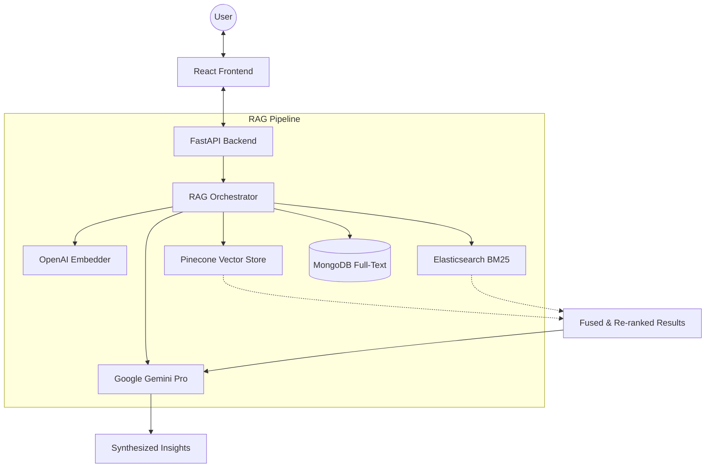

# Patent Discovery System

[](https://opensource.org/licenses/MIT)
[](https://fastapi.tiangolo.com/)
[](https://reactjs.org/)
[](https://tailwindcss.com/)

**Patent Discovery System** is an AI-powered platform designed for intellectual property (IP) professionals, patent attorneys, and engineers. It leverages state-of-the-art **Retrieval-Augmented Generation (RAG)** to perform deep patent searches, prior art discovery, and infringement analysis with high precision.

---

## ✨ Key Features

- 🔍 **AI-Powered Semantic Search**: Goes beyond keyword matching using OpenAI embeddings and Pinecone vector search.
- 📚 **Hierarchical Retrieval**: Optimized search strategy that traverses from patent-level metadata down to specific claim-level details.
- 🤖 **Gemini-Powered Synthesis**: Summarizes complex patent data into actionable insights using Google's Gemini models.
- 🏗️ **Dual-Index Architecture**: High-scale search using separate indices for patent metadata and claim text.
- 📊 **Landscape Analysis**: Visualization and trend analysis of technology sectors.

---

## 🏗️ System Architecture

The system follows a modern monorepo structure with a decoupled frontend and backend, orchestrated via Docker.



---

## 🛠️ Technology Stack

| Layer | Technology |
| :--- | :--- |
| **Frontend** | React 19, TypeScript, Vite, Tailwind CSS, Lucide Icons |
| **Backend** | Python 3.10+, FastAPI, Pydantic, Motor (Async MongoDB) |
| **AI / LLM** | Google Gemini 1.5 Pro, OpenAI (text-embedding-3-small) |
| **Vector DB** | Pinecone (Serverless) |
| **Lexical Search**| Elasticsearch (BM25) |
| **Storage** | MongoDB (Metadata & Raw Text) |
| **Infrastructure**| Docker, Nginx, GitHub Actions |

---

## � Project Structure

```text
Patent-Discovery-System/
├── apps/
│   ├── api/             # FastAPI Backend (Python)
│   │   ├── app/api/     # REST Endpoints & Schemas
│   │   ├── app/services/# RAG, Retrieval, & LLM Logic
│   │   └── README.md    # Detailed Backend Docs
│   └── frontend/        # React Frontend (TS)
│       ├── src/         # UI Components & App Logic
│       └── README.md    # Detailed Frontend Docs
├── docs/                # Architecture & Design Docs
├── docker-compose.yml   # Local deployment configuration
└── README.md            # You are here!
```

---

## 🚀 Getting Started

### Prerequisites

- [Docker](https://www.docker.com/) & Docker Compose
- API Keys for: OpenAI, Google Gemini, and Pinecone.

### Local Development

1. **Clone the repository**:
   ```bash
   git clone https://github.com/your-username/Patent-Discovery-System.git
   cd Patent-Discovery-System
   ```

2. **Configure Environment Variables**:
   Create a `.env` file in the root or in `apps/api/` (refer to `.env.example`).

3. **Spin up the stack**:
   ```bash
   docker-compose up --build
   ```

4. **Access the applications**:
   - **Frontend**: `http://localhost:3000`
   - **API Documentation**: `http://localhost:8000/docs`

---

## 📖 Further Reading

- [Architecture Deep Dive](./docs/architecture.md)
- [Backend Implementation Details](./apps/api/README.md)
- [Frontend Component Guide](./apps/frontend/README.md)

---

## 🤝 Contributing

Contributions are welcome! Please see our [Contributing Guidelines](CONTRIBUTING.md) for more details.

## 📄 License

This project is licensed under the MIT License - see the [LICENSE](LICENSE) file for details.