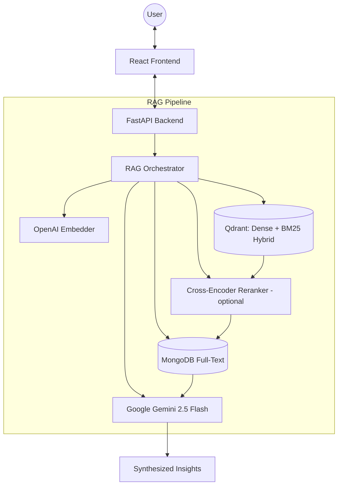

# Patent Discovery System

[](https://fastapi.tiangolo.com/)
[](https://reactjs.org/)
[](https://qdrant.tech/)

**Patent Discovery System** is an AI-powered platform designed for intellectual property (IP) professionals, patent attorneys, and engineers. It leverages state-of-the-art **Retrieval-Augmented Generation (RAG)** to perform deep patent searches, prior art discovery, and infringement analysis with high precision.

---

## ✨ Key Features

- 🔍 **AI-Powered Semantic Search**: Goes beyond keyword matching using OpenAI embeddings fused with BM25 lexical search, server-side, in a single Qdrant collection.
- 📚 **Hierarchical Retrieval**: Optimized search strategy that traverses from patent-level metadata down to specific claim-level details.
- 🤖 **Gemini-Powered Synthesis**: Summarizes complex patent data into actionable, citation-backed insights using Google Gemini 2.5 Flash.
- 🎯 **Three Query Modes**: `prior_art`, `infringement`, and `landscape` — auto-detected from the request, no mode switch required.
- 📈 **Measured, Not Assumed**: Every retrieval default (fusion weights, reranking on/off) is backed by an ablation in [`docs/evaluation.md`](./docs/evaluation.md), not a guess.

---

## 🏗️ System Architecture

The system follows a modern monorepo structure with a decoupled frontend and backend, orchestrated via Docker.


```mermaid
graph TD
    User((User)) <--> Frontend[React Frontend]
    Frontend <--> API[FastAPI Backend]

    subgraph "RAG Pipeline"
        API --> Orchestrator[RAG Orchestrator]
        Orchestrator --> Embedder[OpenAI Embedder]
        Orchestrator --> Qdrant[(Qdrant: Dense + BM25 Hybrid)]
        Orchestrator --> Rerank[Cross-Encoder Reranker - optional]
        Orchestrator --> Storage[(MongoDB Full-Text)]
        Orchestrator --> LLM[Google Gemini 2.5 Flash]
    end

    Qdrant --> Rerank
    Rerank --> Storage
    Storage --> LLM
    LLM --> Answer[Synthesized Insights]
```

---

## 🛠️ Technology Stack

| Layer | Technology |
| :--- | :--- |
| **Frontend** | React 19, TypeScript, Vite, hand-written CSS design system, Lucide Icons |
| **Backend** | Python 3.10+, FastAPI, Pydantic, Motor (Async MongoDB) |
| **AI / LLM** | Google Gemini 2.5 Flash, OpenAI (text-embedding-3-small) |
| **Hybrid Vector Store** | Qdrant — dense + BM25 sparse vectors in one collection, fused via Prefetch + RRF |
| **Reranking** | Cross-encoder (fastembed), optional, off by default |
| **Storage** | MongoDB (Metadata & Raw Text) |
| **Infrastructure**| Docker, Nginx |

---

## 📁 Project Structure

```text
Patent-Discovery-System/
├── apps/
│   ├── api/             # FastAPI Backend (Python)
│   │   ├── app/api/     # REST Endpoints & Schemas
│   │   ├── app/services/# RAG, Retrieval, & LLM Logic
│   │   ├── evaluation/  # Retrieval evaluation harness & fixtures
│   │   └── README.md    # Detailed Backend Docs
│   └── frontend/        # React Frontend (TS)
│       ├── src/         # UI Components & App Logic
│       └── README.md    # Detailed Frontend Docs
├── docs/                # Architecture & Evaluation Docs
├── docker-compose.yml   # Local deployment configuration
└── README.md            # You are here!
```

---

## 🚀 Getting Started

### Prerequisites

- [Docker](https://www.docker.com/) & Docker Compose
- API keys for OpenAI, Google Gemini, and a Qdrant instance ([Qdrant Cloud](https://cloud.qdrant.io/) free tier or self-hosted), plus a MongoDB connection string ([Atlas](https://www.mongodb.com/atlas) free tier works).

### Local Development

1. **Clone the repository**:
   ```bash
   git clone https://github.com/Jenuel/Patent-Discovery-System.git
   cd Patent-Discovery-System
   ```

2. **Configure environment variables**:
   Create `apps/api/.env` (this is what `docker-compose.yml` loads) with:
   ```env
   GEMINI_API_KEY=...
   OPENAI_API_KEY=...
   QDRANT_URL=...
   QDRANT_API_KEY=...
   MONGODB_URI=...
   ```
   See [`apps/api/README.md`](./apps/api/README.md) for the optional retrieval-tuning variables.

3. **Spin up the stack**:
   ```bash
   docker-compose up --build
   ```

4. **Access the applications**:
   - **Frontend**: `http://localhost` (port 80 by default — override with `FRONTEND_PORT`)
   - **API Documentation**: `http://localhost:8000/docs`

   For frontend-only hot-reload development instead of Docker, see [`apps/frontend/README.md`](./apps/frontend/README.md) (`npm run dev`, port 5173).

---

## 📖 Further Reading

- [Architecture Deep Dive](./docs/architecture.md)
- [Retrieval Evaluation](./docs/evaluation.md) — ground truth methodology, ablation results, and why reranking ships disabled
- [Backend Implementation Details](./apps/api/README.md)
- [Frontend Component Guide](./apps/frontend/README.md)