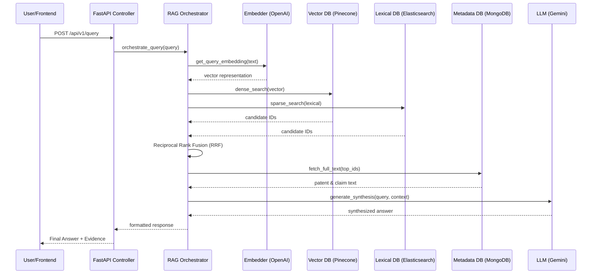

# ⚙️ Patent Discovery System - Backend API

[](https://www.python.org/)
[](https://fastapi.tiangolo.com/)
[](https://www.pinecone.io/)
[](https://www.elastic.co/)
[](https://www.mongodb.com/)

The backend API for the **Patent Discovery System** is a high-performance FastAPI application designed for AI-powered patent search and analysis. It implements a sophisticated **Retrieval-Augmented Generation (RAG)** pipeline that fuses dense and sparse search results to provide highly accurate patent insights.

---

## 🌟 Key Features

- 🧠 **Dual-Index RAG Engine**: Combines **Pinecone** (Semantic/Dense) and **Elasticsearch** (Lexical/Sparse) for high-precision retrieval.
- 📚 **Hierarchical Search Strategy**: Intelligently searches patent-level metadata before drilling down into claim-level specifics.
- 🤖 **LLM Orchestration**: Integrated with **Google Gemini 1.5 Pro** for evidence synthesis and industrial-grade patent analysis.
- ⚡ **Asynchronous Architecture**: Leverages Python's `async/await` and `Motor` (Async MongoDB) for non-blocking I/O.
- 🛡️ **Production Ready**: Includes GZip compression, CORS security, structured logging, and robust error handling.

---

## 🏗️ Backend Architecture

The API core is built around the `RAGOrchestrator`, which manages the following execution flow:



---

## 🛠️ Technology Stack

| Component | Technology |
| :--- | :--- |
| **Framework** | [FastAPI](https://fastapi.tiangolo.com/) |
| **Embeddings** | [OpenAI text-embedding-3-small](https://platform.openai.com/docs/guides/embeddings) |
| **Generative AI**| [Google Gemini 1.5 Pro](https://ai.google.dev/gemini-api/docs) |
| **Vector Index** | [Pinecone Serverless](https://www.pinecone.io/) |
| **Search Engine** | [Elasticsearch (BM25)](https://www.elastic.co/) |
| **State Storage** | [MongoDB](https://www.mongodb.com/) |
| **Logic Layer** | [Service Pattern](https://en.wikipedia.org/wiki/Service_layer) |

---

## 🚀 Getting Started

### 1. Installation
We recommend using `uv` for fast dependency management:

```bash
uv venv
source .venv/bin/activate 

uv pip install -r requirements.txt
```

### 2. Environment Setup
Copy `.env.example` and fill in your API keys:
- `GEMINI_API_KEY`: For LLM synthesis.
- `OPENAI_API_KEY`: For query embedding.
- `PINECONE_API_KEY`: For vector retrieval.

### 3. Run the Server
```bash
uvicorn app.main:app --reload --host 0.0.0.0 --port 8000
```

---

## 📚 API Reference

Visit `http://localhost:8000/docs` for the interactive Swagger UI.

### Main Query Endpoint
`POST /api/v1/query`

**Request Object:**
```json
{
  "query": "A machine learning algorithm for anomaly detection in cloud computing",
  "system_description": "Optional: Detailed description for infringement analysis",
  "filters": {
    "year_from": 2020,
    "assignees": ["Google"]
  }
}
```

**Search Modes:**
- `prior_art`: Comprehensive search for similar inventions.
- `infringement`: Detailed matching between your technology and patent claims.
- `landscape`: High-level summary of technology trends.

---

## 📁 Repository Structure

```text
app/
├── api/             # API v1 Controllers & Pydantic Schemas
├── core/            # Config, Settings, & Global Logging
├── services/        # Business Logic (The "Brain")
│   ├── rag/         # RAG Orchestration & Fusion Logic
│   ├── retrieval/   # Dense/Sparse Search Implementations
│   ├── llm/         # Gemini Integration Client
│   └── indexing/    # Vector & Document Ingestion Utilities
└── main.py          # Application Entry & Lifecycle
```
