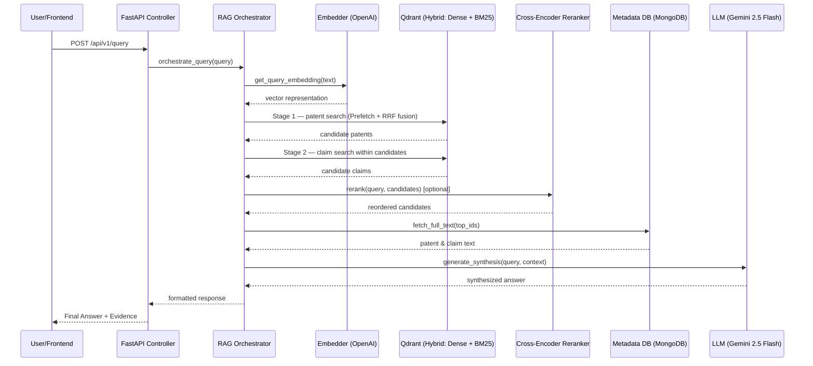

# ⚙️ Patent Discovery System - Backend API

[](https://www.python.org/)
[](https://fastapi.tiangolo.com/)
[](https://qdrant.tech/)
[](https://www.mongodb.com/)

The backend API for the **Patent Discovery System** is a high-performance FastAPI application designed for AI-powered patent search and analysis. It implements a sophisticated **Retrieval-Augmented Generation (RAG)** pipeline that fuses dense and sparse search results to provide highly accurate patent insights.

---

## 🌟 Key Features

- 🧠 **Hybrid RAG Engine**: A single **Qdrant** collection holds both the dense (semantic) and BM25 (lexical) vectors per document, fused server-side via Prefetch + Reciprocal Rank Fusion — one round trip instead of querying two separate stores.
- 📚 **Hierarchical Search Strategy**: Intelligently searches patent-level metadata before drilling down into claim-level specifics.
- 🎯 **Cross-Encoder Reranking**: Optional reranking pass over Stage-1 candidates for finer-grained relevance scoring.
- 🤖 **LLM Orchestration**: Integrated with **Google Gemini 2.5 Flash** for evidence synthesis and industrial-grade patent analysis.
- ⚡ **Asynchronous Architecture**: Leverages Python's `async/await` and `Motor` (Async MongoDB) for non-blocking I/O.
- 🛡️ **Production Ready**: Includes GZip compression, CORS security, structured logging, and robust error handling.

---

## 🏗️ Backend Architecture

The API core is built around the `RAGOrchestrator`, which manages the following execution flow:


```mermaid
sequenceDiagram
    participant U as User/Frontend
    participant A as FastAPI Controller
    participant O as RAG Orchestrator
    participant E as Embedder (OpenAI)
    participant Q as Qdrant (Hybrid: Dense + BM25)
    participant R as Cross-Encoder Reranker
    participant M as Metadata DB (MongoDB)
    participant G as LLM (Gemini 2.5 Flash)

    U->>A: POST /api/v1/query
    A->>O: orchestrate_query(query)
    O->>E: get_query_embedding(text)
    E-->>O: vector representation
    O->>Q: Stage 1 — patent search (Prefetch + RRF fusion)
    Q-->>O: candidate patents
    O->>Q: Stage 2 — claim search within candidates
    Q-->>O: candidate claims
    O->>R: rerank(query, candidates) [optional]
    R-->>O: reordered candidates
    O->>M: fetch_full_text(top_ids)
    M-->>O: patent & claim text
    O->>G: generate_synthesis(query, context)
    G-->>O: synthesized answer
    O-->>A: formatted response
    A-->>U: Final Answer + Evidence
```

---

## 🛠️ Technology Stack

| Component | Technology |
| :--- | :--- |
| **Framework** | [FastAPI](https://fastapi.tiangolo.com/) |
| **Embeddings** | [OpenAI text-embedding-3-small](https://platform.openai.com/docs/guides/embeddings) |
| **Generative AI**| [Google Gemini 2.5 Flash](https://ai.google.dev/gemini-api/docs) |
| **Hybrid Vector Store** | [Qdrant](https://qdrant.tech/) — dense + BM25 sparse vectors in one collection, fused via Prefetch + RRF |
| **Reranking** | Cross-encoder ([fastembed](https://github.com/qdrant/fastembed)), optional |
| **State Storage** | [MongoDB](https://www.mongodb.com/) |
| **Logic Layer** | [Service Pattern](https://en.wikipedia.org/wiki/Service_layer) |

---

## 🚀 Getting Started

### 1. Installation
We recommend using `uv` for fast dependency management:

```bash
uv venv
source .venv/bin/activate 

uv pip install -r requirements.txt
```

### 2. Environment Setup
Set the following environment variables:
- `GEMINI_API_KEY`: For LLM synthesis.
- `OPENAI_API_KEY`: For query embedding.
- `QDRANT_URL` / `QDRANT_API_KEY`: For hybrid vector retrieval.
- `MONGODB_URI`: For patent & claim text storage.

Optional retrieval tuning (all have defaults; the defaults are what ships):

| Variable | Default | Effect |
|---|---|---|
| `RETRIEVAL_ARM` | `hybrid` | Stage-1 patent arm. `hybrid` fuses dense + BM25 inside Qdrant (one round trip). `weighted` fuses them client-side with the weights below, which Qdrant's native RRF cannot express (two round trips). `dense` and `bm25` pin a single arm. |
| `FUSION_DENSE_WEIGHT` | `0.9` | Dense-arm weight. `RETRIEVAL_ARM=weighted` only. |
| `FUSION_SPARSE_WEIGHT` | `0.1` | BM25-arm weight. `RETRIEVAL_ARM=weighted` only. |
| `RERANK_ENABLED` | `false` | Cross-encoder rerank over Stage-1 candidates. |
| `RERANK_MODEL` | `Xenova/ms-marco-MiniLM-L-6-v2` | Cross-encoder to load when reranking is on. |

The 0.9 / 0.1 default comes from [`docs/evaluation.md`](../../docs/evaluation.md) Test 6, which measured it at +0.025 MRR, +0.087 recall@10 and +0.113 nDCG@10 over the `hybrid` default on the pooled query set. It is **not** enabled by default — the confidence intervals overlap and it costs an extra Qdrant round trip.

### 3. Run the Server
```bash
uvicorn app.main:app --reload --host 0.0.0.0 --port 8000
```

---

## 📚 API Reference

Visit `http://localhost:8000/docs` for the interactive Swagger UI, or `/redoc` / `/openapi.json`. Base URL: `/api/v1`.

**Utility endpoints:** `GET /` (service info), `GET /health` (liveness), `GET /ready` (503 if a required API key is missing).

### Main Query Endpoint
`POST /api/v1/query`

Runs the full RAG pipeline (embedding → hybrid retrieval → optional rerank → LLM generation) and returns a synthesized answer with supporting evidence. The mode is **auto-detected** from the request — it cannot be set manually.

**Request (`QueryRequest`)**

| Field | Type | Required | Description |
|---|---|---|---|
| `query` | `string` | ✅ | Natural-language question, min. 3 characters. |
| `system_description` | `string \| null` | ❌ | Your own product/system description — providing this forces `infringement` mode. |
| `filters` | `QueryFilters \| null` | ❌ | `cpc_prefixes: string[]`, `year_from`/`year_to: int`, `assignees: string[]` — all optional, combine freely. |

```json
{
  "query": "A machine learning algorithm for anomaly detection in cloud computing",
  "system_description": "Optional: Detailed description for infringement analysis",
  "filters": {
    "year_from": 2020,
    "assignees": ["Google"]
  }
}
```

**Response (`QueryResponse`)**

| Field | Type | Description |
|---|---|---|
| `mode` | `string` | Detected mode: `prior_art`, `infringement`, or `landscape`. |
| `answer` | `string` | LLM-generated answer synthesized from retrieved evidence. |
| `evidence` | `EvidenceItem[]` | Ranked supporting chunks — each has `chunk_id`, `patent_id`, `level` (`patent`/`claim`/`limitation`), `title`, `claim_no`, `text`, `score`, `source` (`dense`/`sparse`/`hybrid`/`reranked`), and `metadata`. |

**Search Modes** (priority: `infringement` > `landscape` > `prior_art`):
- `prior_art` — default; identifies relevant prior art and how it relates to the query.
- `infringement` — triggered by `system_description` or the words `infringement`/`infringe`; matches your tech against patent claims.
- `landscape` — triggered by `landscape`, `summary`, `trend`, `overview`, or `analysis`; summarizes technology trends.

**Errors:** `400` (bad request params), `422` (Pydantic validation — response adds `error` and `body` fields alongside `detail`), `500` (unexpected failure). Every response carries `X-Request-ID` and `X-Process-Time` headers.

```bash
curl -X POST http://localhost:8000/api/v1/query \
  -H "Content-Type: application/json" \
  -d '{"query": "method for compressing neural network weights using quantization"}'
```

---

## 📁 Repository Structure

```text
app/
├── api/             # API v1 Controllers & Pydantic Schemas
├── core/            # Config, Settings, & Global Logging
├── services/        # Business Logic (The "Brain")
│   ├── rag/         # RAG Orchestration & Fusion Logic
│   ├── retrieval/   # Dense/Hybrid Search & RRF Fusion
│   ├── rerank/      # Cross-Encoder Reranking
│   ├── llm/         # Gemini Integration Client
│   ├── indexing/    # Qdrant Schemas, Embedding & Ingestion Utilities
│   ├── patents/     # Patent Parsing & Chunking
│   └── storage/     # MongoDB Store
└── main.py          # Application Entry & Lifecycle
```
